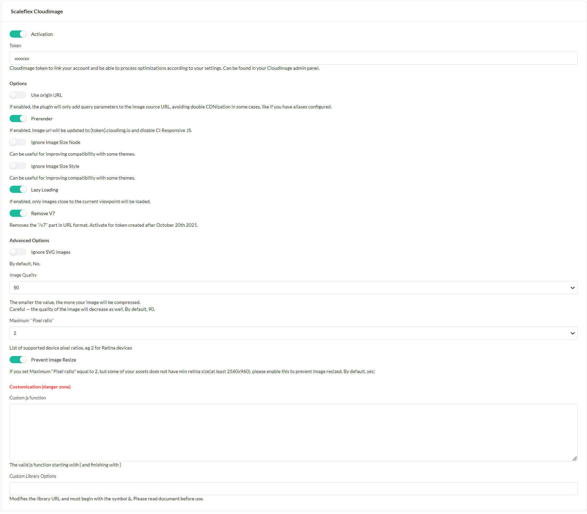

# Installation

### Step 1: Download the plugin
Open a command console, enter your project directory and execute the 
following command to download the latest stable version of this bundle:

```shell
 composer require scaleflex/sylius-cloudimage-plugin
```

This command requires you to have Composer [installed globally](https://getcomposer.org/doc/00-intro.md), as explained in the installation 
chapter of the Composer documentation.

### Step 2: Enable the plugin
Then, enable the plugin by adding it to the list of registered 
plugins/bundles in config/bundles.php file of your project:

```injectablephp
<?php

# config/bundles.php

return [
    // ...
    Scaleflex\SyliusCloudimagePlugin\ScaleflexSyliusCloudimagePlugin::class => ['all' => true],
];
```

### Step 3: Configure the plugin

#### Update Channel Model
Your Entity Channel has to implement ```\Scaleflex\SyliusCloudimagePlugin\Model\ExtendedChannelInterface``` 
You can use Trait ```\Scaleflex\SyliusCloudimagePlugin\Model\ExtendedChannelTrait```

Then add to your config

```yaml
# config/packages/_sylius.yaml
sylius_channel:
    resources:
        channel:
            classes:
                model: App\Entity\Channel #Your Channel Model
```

Upgrade database

```shell
bin/console doctrine:migration:diff
bin/console doctrine:migration:migrate
```

#### Update Channel Form
Include ```{{ include('@ScaleflexSyliusCloudimagePlugin/Admin/Channel/extendedChannelForm.html.twig') }}```
in your ```templates/bundles/SyliusAdminBundle\Channel\_form.html.twig```

_Example:_
```html
{{ form_errors(form) }}
<div class="ui two column stackable grid">
        <!-- Example -->
        {{ include('@ScaleflexSyliusCloudimagePlugin/Admin/Channel/extendedChannelForm.html.twig') }}
</div>

```

#### Change the config


**Options**

**Prerender:** If enabled, image url will be updated to {token}.cloudimg.io and disable CI Responsive JS.

**Use origin URL:** If enabled, the module will only add query parameters to the image source URL without prefixing it with `{token}.cloudimg.io`.

**Ignore Image Size Node:** useful for improving compatibility with some themes.

**Ignore Image Size Style:** useful for improving compatibility with some themes.

**Lazy Loading:** if enabled, images will be lazy-loaded for better loading times and user experience.*

*lazy loading can have variable results on some websites as for the first rows of images loaded, therefore it is recommended to make use of an integrated new class provided: “lazy-off”. You can specify the "lazy-off" class either in the page builder through the back-office, or in the templates directly (eg. category page and product page).

**Remove V7:** Removes the "/v7" part in URL format. Activate for token created after October 20th 2021.*

**Advanced Configuration** [Optional]
This setting is for advanced users only and allows to inject a custom JS function into the Magento templates in order to support some specific Magento templates. Feel free to contact us in order to get the custom JS function to inject to address issues with your specific template.

**Custom js function**: The js function to customize Cloudimage library.

**Image Quality**: Customizes the image quality, therefore compression -size- applied by default. (warning, a setting under 80 might have a potentially visible impact)

**Ignore SVG images**: If enabled, all SVG images will be skipped from acceleration as anyway vector images will not be compressed.

**Maximum "Pixel ratio"**: List of supported device pixel ratios, default is 2, eg: 2 for Retina devices

**Custom Library Options**: Those optional parameters will be added to the request for each URL going through the Cloudimage acceleration infrastructure. It can allow you to force image formats, apply automatic transformations or watermarking, and might be used for troubleshooting purposes. (for advanced users only, please refer to the official [Cloudimage documentation here](https://docs/cloudimage.io) for the list of possible parameters)


#### Include Script
You can listen to any template events to include our script:
- Script ```@ScaleflexSyliusCloudimagePlugin\Shop\cloudimageScript.html.twig```
- Process ```@ScaleflexSyliusCloudimagePlugin\Shop\cloudimageProcess.html.twig```
_Example_
```yaml
# config/packages/sylius_ui.yaml
sylius_ui:
  events:
    sylius.shop.layout.head:
      blocks:
        cloudimage_script: '@ScaleflexSyliusCloudimagePlugin\Shop\cloudimageScript.html.twig'
    sylius.shop.layout.after_body:
      blocks:
        cloudimage_process: '@ScaleflexSyliusCloudimagePlugin\Shop\cloudimageProcess.html.twig'
```


#### Override Template
To process your image through Cloudimage you have two ways to implement

- Way 1: Use ```ci_src(path)``` Twig Function
```html
#templates/bundles/SyliusShopBundle/Product/_mainImage.html.twig


  
  
  
  
  
  

  
```

- Way 2: Define your own
  - Update the image ```src``` to ```ci-src="{path}?q={sylius.channel.cloudimageImageQuality}"```
  - Add script
  ```html
    
        <script>
            window.ciResponsive.process();
        </script>
    
  ```
